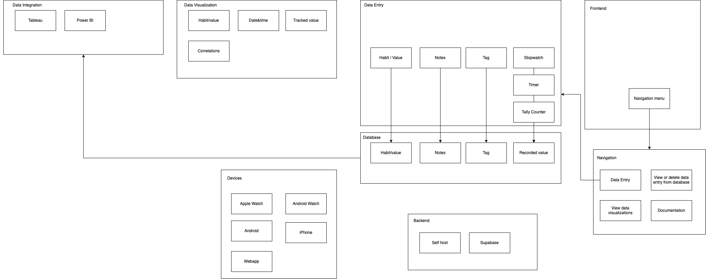

# Quantified Self
Idea for quantified self tracker for habits with stopwatch, timer and tally counter, with data visualization. Im currently using multiple apps for achiving the same thing, so combining them all into one database and frontend would be cool. Apps that I use include [Wim Hof Method](https://apps.apple.com/fi/app/wim-hof-method/id890471578), [Timer & Stopwatch - Timeglass](https://apps.apple.com/fi/app/timer-stopwatch-timeglass/id1138584627), [Multi-Stopwatch](https://apps.apple.com/fi/app/multi-stopwatch/id933638040), [QTally - A Better Tally Counter](https://apps.apple.com/fi/app/qtally-a-better-tally-counter/id1111926262) & [Habitify - Habit Tracker & Goal](https://apps.apple.com/fi/app/habitify-habit-tracker-goal/id1111447047).

The app could include its own data visualization but more importantly offer easy integration of the single SQL database to Data Visualization tools like Tableau, Power BI etc and Plotly for making your own dashboards.

